# Promotion Coach Workflow Graphs
This document contains visual representations of the Promotion Coach workflow structure.


## Graph Structure Summary:
## ==================================================

```
Entry: route_workflow
  ├─> competency_analyzer (first_time)
  │     ├─> gap_analyzer
  │     └─> promotion_package (parallel)
  │
  └─> gap_analyzer (with_existing_outputs)
        └─> collect_preferences
              └─> opportunity_finder
                    ├─> tools (if tool calls)
                    │     └─> process_tool_results
                    │           └─> human_review
                    └─> human_review (if no tools)
                          ├─> human_review (if edit)
                          └─> save_outputs
                                └─> END
```

### Streaming Event Flow Diagram


### Example: Streaming Flow for Gap Analyzer Node

```mermaid
sequenceDiagram
    participant LG as LangGraph
    participant Adapter as LangGraphStreamAdapter
    participant Handler as StreamingHandler
    participant Console as Console

    LG->>Adapter: on_chain_start ("gap_analyzer")
    Adapter->>Handler: handle_node_start("gap_analyzer")
    Handler->>Console: "🔍 Starting Gap Analysis..."
    
    LG->>Adapter: on_chat_model_stream
    Adapter->>Handler: handle_node_generating("gap_analyzer")
    Handler->>Console: "💭 Generating Gap Analysis..."
    
    Note over Handler: Subsequent stream events suppressed<br/>(already in generation_shown)
    
    LG->>Adapter: on_chain_end ("gap_analyzer")
    Adapter->>Handler: handle_node_end("gap_analyzer", output)
    Handler->>Console: "✅ Gap Analysis complete"<br/>"✓ Gap analysis saved"
```



## Workflow Explanation

### First Time Workflow
When running for the first time (no previous outputs):
1. **Route Workflow** → Routes to `competency_analyzer`
2. **Competency Analyzer** → Analyzes promotion requirements
3. **Gap Analyzer** → Identifies skill gaps (runs after competency analysis)
4. **Promotion Package** → Creates promotion documents (runs in parallel with gap analyzer)
5. **Collect Preferences** → Asks user for learning preferences
6. **Opportunity Finder** → Finds growth opportunities
   - If tools are used: **Tools** → **Process Tool Results** → **Human Review**
   - If no tools: **Human Review** directly
7. **Human Review** → User can edit, approve, or skip
8. **Save Outputs** → Saves all results
9. **End**

### With Existing Outputs Workflow
When previous outputs exist:
1. **Route Workflow** → Routes to `gap_analyzer` (skips competency analysis)
2. **Gap Analyzer** → Updates gap analysis
3. **Collect Preferences** → Asks user for learning preferences
4. **Opportunity Finder** → Finds growth opportunities
5. **Human Review** → User can edit, approve, or skip
6. **Save Outputs** → Saves updated results
7. **End**

## Agents Overview

This section describes each agent in the workflow, what they do, and why they are important for the promotion coaching process.

### 1. Competency Analyzer

**What it does:**
- Analyzes company leveling documents to extract competency requirements for the target promotion level
- Creates a structured framework of technical, leadership, and soft skill requirements
- Maps discipline-specific expectations (e.g., Software Engineering, Data Engineering)
- Identifies level differentiators that distinguish the target level from the current level
- Defines expected scope and impact at the target level

**Why it's important:**
- **Foundation for analysis**: Provides the benchmark against which current capabilities are measured
- **Clarity on requirements**: Translates often-vague company leveling documents into concrete, actionable competency categories
- **Objective framework**: Removes ambiguity about what's needed for promotion
- **Discipline-specific**: Ensures analysis is relevant to the engineer's specific role and domain
- **First step dependency**: All subsequent analysis (gap analysis, opportunities, promotion package) depends on this foundation

**Input:** Company leveling document, engineer name, current/target levels, discipline  
**Output:** Structured competency framework with categories, requirements, importance levels, and evaluation criteria

---

### 2. Gap Analyzer

**What it does:**
- Compares engineer's current capabilities against target-level requirements
- Analyzes multiple evidence sources:
  - Project contributions and technical achievements
  - Manager feedback and performance reviews
  - Peer feedback and collaboration examples
  - Self-assessment and personal reflections
- Identifies specific skill gaps with priority levels (high, medium, low)
- Assesses the impact and feasibility of closing each gap
- Prioritizes gaps based on their significance for promotion readiness
- Provides actionable development recommendations

**Why it's important:**
- **Honest assessment**: Provides objective evaluation of where the engineer stands vs. where they need to be
- **Prioritization**: Helps focus effort on the most impactful gaps first
- **Evidence-based**: Uses concrete data from multiple sources, not just assumptions
- **Actionable insights**: Identifies not just what's missing, but how feasible it is to address
- **Roadmap foundation**: Creates the foundation for identifying learning opportunities and project work

**Input:** Competency requirements, project contributions, manager notes, performance reviews, peer feedback, self-assessment  
**Output:** Prioritized list of gaps with descriptions, impact assessments, and development recommendations

---

### 3. Opportunity Finder

**What it does:**
- Identifies growth opportunities to close identified skill gaps
- Searches for learning courses online (when user requests) using external tools
- Matches courses to specific skill gaps with consideration for:
  - Learning budget constraints
  - Preferred learning style (online, in-person, hybrid)
  - Time availability
- Identifies internal project opportunities from:
  - Project pipeline (upcoming projects)
  - Company initiatives (strategic priorities)
  - Team roadmap (planned work)
- Recommends quick wins (immediate opportunities) and stretch goals (long-term challenges)
- Prioritizes opportunities based on impact, feasibility, and alignment with gaps

**Why it's important:**
- **Actionable next steps**: Transforms gap analysis into concrete actions the engineer can take
- **Personalized recommendations**: Considers individual constraints (budget, time, learning style)
- **Balanced approach**: Combines external learning (courses) with internal experience (projects)
- **Strategic alignment**: Ensures opportunities align with both personal growth and company priorities
- **Tool integration**: Uses real-time course search to find current, relevant learning resources
- **Practical prioritization**: Helps engineers focus on opportunities that will have the most impact

**Input:** Gap analysis, learning preferences (budget, style, time), project pipeline, company initiatives, team roadmap  
**Output:** Structured recommendations with learning courses (with links, prices, duration), project opportunities, quick wins, stretch goals, and recommended priorities

---

### 4. Promotion Package

**What it does:**
- Creates professional promotion package documents that highlight engineer's achievements
- Synthesizes evidence from multiple sources into compelling narratives
- Maps accomplishments to specific competencies required for the target level
- Creates an executive summary that distills key achievements
- Organizes key accomplishments with supporting evidence
- Demonstrates growth areas and continued development commitment
- Provides recommendations for promotion with justification

**Why it's important:**
- **Documentation for promotion**: Creates the actual document used in promotion discussions and reviews
- **Evidence-based presentation**: Ensures all claims are backed by concrete examples and data
- **Competency alignment**: Explicitly connects achievements to the target level's requirements
- **Professional presentation**: Uses evidence-based writing and impactful language while remaining honest
- **Complete picture**: Combines technical achievements, leadership examples, and business impact
- **Time-saving**: Automates the often time-consuming task of compiling promotion documentation
- **Comprehensive coverage**: Includes accomplishments, evidence mapping, stakeholder feedback, and growth areas

**Input:** Competency requirements, project contributions, manager notes, performance reviews, peer feedback, self-assessment  
**Output:** Professional promotion package with executive summary, key accomplishments, competency evidence mapping, stakeholder feedback summary, growth areas, and promotion recommendations

---

## Agent Dependencies

The agents work together in a specific sequence to build comprehensive promotion readiness analysis:

1. **Competency Analyzer** → Creates the target (what's needed)
2. **Gap Analyzer** → Compares current vs. target (where you are vs. where you need to be)
3. **Opportunity Finder** → Identifies paths to close gaps (how to get there)
4. **Promotion Package** → Documents achievements (how to present your case)

**Parallel execution:** Gap Analyzer and Promotion Package run in parallel after Competency Analyzer completes, as they both depend on competency requirements but don't depend on each other.

## Streaming Architecture

The workflow uses LangGraph's native event system (`astream_events`) to provide real-time progress feedback. This section explains how streaming works and how events flow through the system.

### Event Types and Their Purpose

| Event Type | When It Fires | Handler Method | Console Output | State Updates |
|------------|---------------|----------------|----------------|---------------|
| `on_chain_start` | When a node/chain begins execution | `handle_node_start()` | `🔍 Starting [Node Name]...` | Sets `active_node`, resets `generation_shown` |
| `on_chat_model_stream` | When LLM generates tokens (streaming) | `handle_node_generating()` | `💭 Generating [Node Name]...` (once per node) | Adds node to `generation_shown` set |
| `on_chain_end` | When a node/chain completes | `handle_node_end()` | `✅ [Node Name] complete`<br/>`✓ [Output] saved` | Updates `final_state`, clears `active_node`, tracks `logged_outputs` |
| `on_tool_start` | When a tool begins execution | `handle_tool_start()` | `🌐 Searching for courses: [skill]...`<br/>`🔧 Executing tool: [name]...` | Sets tool in `active_tools` |
| `on_tool_end` | When a tool completes | `handle_tool_end()` | `✓ Course search completed`<br/>`✓ Tool [name] completed` | Clears tool from `active_tools` |
| `on_tool_error` | When a tool encounters an error | `handle_tool_error()` | `❌ Tool error: [name] - [error]` | Clears tool from `active_tools` |
| `on_chain_error` | When a node/chain fails | `handle_node_error()` | `❌ [Node Name] failed: [error]` | Clears `active_node`, removes from `generation_shown` |
| `on_graph_update` | Graph-level state changes | `handle_state_update()` | None | Updates `final_state` |

**Architecture Note:** The `LangGraphStreamAdapter` processes LangGraph events and converts them to calls on `StreamingHandler` methods. This abstraction separates framework-specific event handling from business logic.

### State Variables Explained

The streaming system uses several state variables that persist across event iterations:

- **`active_node`**: Tracks which node is currently running
  - Set by: `on_chain_start` 
  - Used by: `on_chain_end`, `on_chat_model_stream`, `on_chain_error`
  - Cleared by: `on_chain_end`, `on_chain_error`
  
- **`generation_shown`**: Prevents duplicate "Generating..." messages
  - Set by: `on_chat_model_stream` (adds node name)
  - Used by: `on_chat_model_stream` (checks if already shown)
  - Reset by: `on_chain_start` (discards node name)
  
- **`logged_outputs`**: Prevents duplicate "saved" messages
  - Set by: `on_chain_end` (adds output type)
  - Used by: `on_chain_end` (checks if already logged)
  
- **`active_tools`**: Tracks which tools are currently executing
  - Set by: `on_tool_start` (marks tool as active)
  - Used by: `on_tool_end`, `on_tool_error`
  - Cleared by: `on_tool_end`, `on_tool_error`

### Key Design Decisions

1. **Abstraction Layer**: `StreamingHandler` contains pure business logic, while `LangGraphStreamAdapter` handles framework-specific event conversion. This makes the system testable and framework-independent.
2. **Event-Based Architecture**: Uses LangGraph's native `astream_events` API instead of custom streaming, ensuring compatibility with LangGraph's execution model
3. **State Persistence**: State variables (`active_node`, `generation_shown`, etc.) persist across the async event loop to coordinate between handlers
4. **Deduplication**: `generation_shown` set prevents spam by showing "Generating..." only once per node, even with many stream events
5. **Node Matching**: `_match_node_name()` helper handles both exact matches ("gap_analyzer") and nested names ("gap_analyzer.gap_analyzer_node")
6. **Progress Visibility**: Each major step (start, generating, complete) has clear visual indicators with emoji and colors

### Benefits of This Approach

- **Real-time feedback**: Users see progress as nodes execute, not just at the end
- **Non-intrusive**: Uses LangGraph's built-in event system, no custom hooks needed
- **Reliable**: Events are emitted automatically by LangGraph, ensuring we capture all state changes
- **Extensible**: Easy to add new event types or modify handlers without changing agent code
- **Debuggable**: Clear separation between event emission (LangGraph) and handling (workflow.py)

## Color Coding

- **Green (Start)**: Entry point
- **Pink (End)**: Exit point
- **Light Blue**: Analysis agents (Competency, Gap, Promotion, Opportunity)
- **Gold (Review)**: Human-in-the-loop step
- **Teal (Save)**: Output persistence step